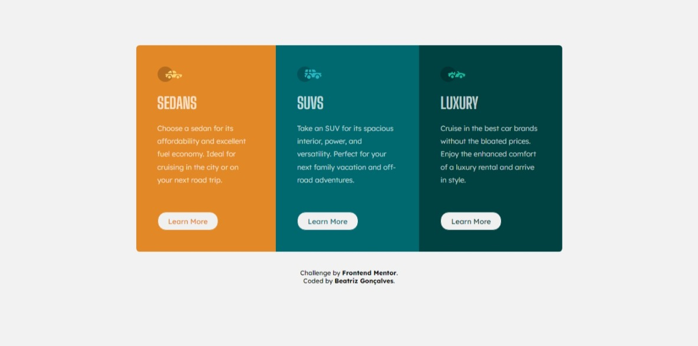
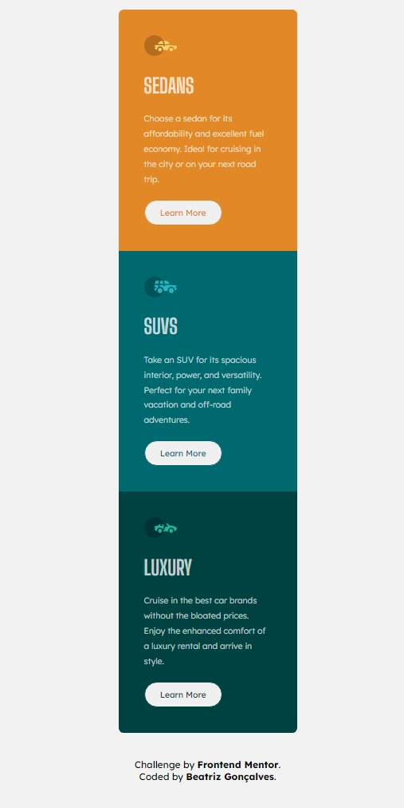

# Frontend Mentor - 3-column preview card component solution

Esta é uma solução para [3-column preview card component challenge on Frontend Mentor](https://www.frontendmentor.io/challenges/3column-preview-card-component-pH92eAR2-). Os desafios do Frontend Mentor ajudam você a melhorar suas habilidades de codificação através da construção de projetos realistas.

## Table of contents

- [Frontend Mentor - 3-column preview card component solution](#frontend-mentor---3-column-preview-card-component-solution)
  - [Table of contents](#table-of-contents)
  - [Visão Geral](#visão-geral)
    - [O desafio](#o-desafio)
    - [Screenshot](#screenshot)
      - [Desktop](#desktop)
      - [Mobile](#mobile)
    - [Links](#links)
  - [Meu processo](#meu-processo)
    - [Construído com](#construído-com)
    - [Desenvolvimento contínuo](#desenvolvimento-contínuo)
  - [Autora](#autora)

## Visão Geral

### O desafio

Os usuários deverão ser capazes de:

- Vizualizar o layout ideal dependendo do tamanho de tela de seu dispositivo
- Ver estados de foco para elementos interativos

### Screenshot

#### Desktop

#### Mobile

### Links

- Solução URL: [Frontend Mentor]()
- Site URL: [Github Pages](https://beatrizvsgoncalves.github.io/3-column-preview-card-component-main/)

## Meu processo

### Construído com

- Tags semânticas
- Flexbox
- Mobile-first workflow

### Desenvolvimento contínuo

Consegui terminar este projeto em 2 horas. Foi muito boa para treinar CSS. Quero aumentar o nível de dificuldade em breve.

## Autora

- Github - [beatrizvsgoncalves](https://github.com/beatrizvsgoncalves)
- LinkedIn - [beatriz-vs-goncalves](https://www.linkedin.com/in/beatriz-vs-goncalves/)
- Frontend Mentor - [@beatrizvsgoncalves](https://www.frontendmentor.io/profile/beatrizvsgoncalves)